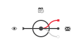
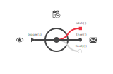
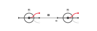
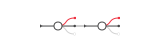
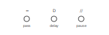
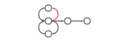
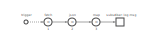
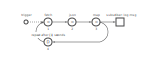
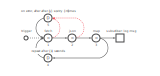
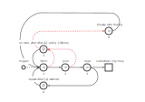

# ReGraFX - Reactive Graph

The power of **Promises**, **Observers** and **Graph** brought together to build a great data Flux.


## Why it is called ReGraFX?

-   It uses the ```Observer``` pattern, that's why it is **Re**.active;
-   It builds a Graph of scheduled async-tasks, that's why it is **Gra**.ph;
-   ```Message```s and their  ```Token```s flow in the graph following their behavioural paths, that's why we use the word **F**.lu.**X**;

> We are going to call this kind of architecture **Reactive Graphs** or **RGFX**!

## Summary

- [Introduction](#intro)
- [Vertex](#vertex)
- [Edge](#edge)
- [Promise](#promise)
- [Scheduler](#scheduler)
- [Visual](#visual)
- [Composite Vertex](#composite)
- [Example](#example)

<a name="intro"></a> 
## Introduction

We can describe an application as a set of decoupled graphs that cooperate to achieve a goal.
Every graph represents a process.
A process might decompose in many simple tasks.

<a name = "vertex"></a> 
### The Vertex (aka Node)

Every ```Vertex``` of our graph represents a ```Task``` (it wraps a task).
A task receives an input and produces an output.
A task can be successful or not.
A task can be synchronous or asynchronous; we wrap the output of a synchronous task inside a Promise (resolved of reject).

```js
const aFunction = x => 2 * x; 
const vertex = new Vertex(new Task(aFunction));
```
<a name = "edge"></a> 
### The Edge

Every edge of our graph links two nodes (tasks).
We deliver the output of a task to another node using notifications that transit along edges (subscriptions).
Every node links other nodes with a 1-to-many relation.
Every linked node observes the outcome of its parent tasks.
That means that the outputs of a node are Observables and the inputs are Observers.

<a name = "promise"></a> 
### The Promise

The output of a task is wrapped inside a promise.
Every node keeps two collections of observers:

-   The first collection "subscribes" to successful outcome (then),
-   The second collection "subscribes" to failures (catch).

> a third, less used (?),  collection "subscribes" to the Promise finally.

```js
const vertex1 = new Vertex(new Task((x, y, z) => x + y + z));
const vertex2 = new Vertex(new Task(x => 2 * x));
const vertex3 = new Vertex(new Task(console.error)));
const vertex4 = new Vertex(new Task(console.debug));

vertex1.to(vertex2);
vertex1.err(vertex3);
vertex1.final(vertex4);

vertex2.subscribe(aFunction);

const token = vertex1.trigger(1, 2, 3);

```

<a name = "scheduler"></a> 
### The Scheduler

We would like to schedule the execution of a task.
That means that the node contains a ```Scheduler``` that executes or delays the task.
The Scheduler has the ability to **cancel** the task execution by mean of a token that flows along the graph.

-   The default schedule executes as soon as receiving the input message notification.
-   The delayed schedule executes after the required time.
-   The pause schedule pauses until required.
    The listed schedulers are just examples. There can be other schedulers.

```js
const aFunction = x => 2 * x; 
const delay = 1000; // milliseconds
const vertex = new Vertex(new Task(aFunction), new Scheduler(delay));
```

To cancel:

```js
const message = vertex.trigger();
message.token().cancel();
```

<a name = "visual"></a> 
### Visually 

The following image represents a node:



-   The data flows from the left to the right.
-   The **eyes** means that the **input** link is an **observer** (there can be multiple links/observers).
-   The **inner circle** represents the node **task** (that returns a Promise).
-   The **clock** represents the task **scheduler**,
-   The **envelope** means that the output is an observable that can notify the connected nodes. Every envelope contains a token used to trace the path and to cancel the tasks execution. There are three possible outcomes:
    -   the notification message of a successful task, associated to Promise.prototype.then(),
    -   the error of a failure, associated to Promise.prototype.catch(),
    -   the finally, associated to Promise.prototype.finally()

The following image represents two connected nodes:



And this is the simplified representation:



What follows represents the node scheduler; the task execution may be immediate, delayed or paused (i.e):



Connecting nodes we can build a **reactive graph**:



Therefore, a **reactive graph** represents a collection of scheduled async-tasks that cooperate to build a process (either simple or complex).
The graph is directed and can contain cycles, that means that we can build powerful applications.

> Please note that drawing the graph, the behaviour of the application is even clear and well documented!

<a name = "composite"></a> 
### The Composite Vertex  - Reusable Reactive Graphs 

> We can wrap reactive graphs (sub-graphs) inside classes that make them reusable!

RegraFX provides a ```CompositeVertex``` class that can be extended to deal with a reactive grap as it would be a simple Vertex.  

```js
class MyCompositeVertex extends CompositeVertex{
    // ...
}
```
<a name = "example"></a>
## Example 

Let's say that we would like to build an application that repeatedly fetches data from a resource and map the response to something that would be consumed.
The Fetch API provides an interface for fetching resources. We are going to use it for our example.

### Step 1

The graph describe our application:


```javascript

// Fetch - Task
let fetchTask = new RGFX.Task(() => fetch('foo.json'));
let fetchNode = new RGFX.Vertex(fetchTask);

// From fetch response to json - Task
let jsonTask = new RGFX.Task(response => response.json());
let jsonNode = new RGFX.Vertex(jsonTask);

// Build the Graph 
fetchNode.to(jsonNode); // (fetchNode) --> (jsonNode)

// Subscribe the jsonNode
jsonNode.subscribe(promise => promise.then(data => {
    // consume data
    console.log(data);
}));

```

### Step 2

Now, we add a mapping node:



```js

/* ... */

// Map - Task
let mapTask = new  RGFX.Task(data => data*2);
let mapNode = new  RGFX.Vertex(mapTask);

// Build the Graph
fetchNode.to(jsonNode);
jsonNode.to(mapNode);

// Subscribe the mapNode
mapNode.subscribe(promise => promise.then(data => {
    // consume data
    console.log(data);
);

```

### Step 3

Now, to poll the resources every 1 seconds, we add a repeat node



```js

/* ... */

// Repeat every 1 s - Task
let repeatTask = new  RGFX.Task((()=>{}));
let repeatNode = new  RGFX.Vertex(repeatTask, new  RGFX.Scheduler(1000));

// Build the Graph 
fetchNode.to(jsonNode);
jsonNode.to(mapNode);
mapNode.to(repeatNode);

repeatNode.to(fetchNode);

fetchNode.err(retryNode);
jsonNode.err(retryNode);

retryNode.to(fetchNode);

// Subscribe the mapNode
mapNode.subscribe(promise => promise.then(data => {
    // consume data
    console.log(data);
}));

```

### Step 4


We want to manage erros, let's say that id the fetch or json tasks fail, we want retry 3 times, every 2 s:



```js

/* ... */

// On error, retry 3 times every 2 s,  - Task
let keeper = { count: 0 };
let retryTask = new  RGFX.Task(
    err => 
        new Promise((resolve, reject) => {
            keeper.count++ > 2 ?
                (() => { keeper.count = 0; reject(err) })()
                : resolve(err);
        })
);
let retryNode = new  RGFX.Vertex(retryTask, new  RGFX.Scheduler(2000));

// Build the Graph
fetchNode.to(jsonNode);
jsonNode.to(mapNode);
mapNode.to(repeatNode);

repeatNode.to(fetchNode);

fetchNode.err(retryNode);
jsonNode.err(retryNode);
retryNode.to(fetchNode);

// Subscribe the mapNode
mapNode.subscribe(promise => promise.then(data => {
    // consume data
    console.log(data);
}));


```

### Step 5

After 3 errors, we show a dialog



```javascript

/* ... */

// After 3 errors, show a dialog
let errorDialogTask = new  RGFX.Task(err => alert(err));
let errorDialogNode = new  RGFX.Vertex(errorDialogTask);

// Build the Graph
fetchNode.to(jsonNode);
jsonNode.to(mapNode);
mapNode.to(repeatNode);

repeatNode.to(fetchNode);

fetchNode.err(retryNode);
jsonNode.err(retryNode);
retryNode.to(fetchNode);
retryNode.err(errorDialogNode)

// Subscribe the mapNode
mapNode.subscribe(promise => promise.then(data => {
    // consume data
    console.log(data);
}));


```

The entire source code:

```javascript

// Fetch - Task
let fetchTask = new RGFX.Task(() => fetch('foo.json'));
let fetchNode = new RGFX.Vertex(fetchTask);

// Fetch response to json - Task
let jsonTask = new RGFX.Task(response => response.json());
let jsonNode = new RGFX.Vertex(jsonTask);

// Map - Task
let mapTask = new RGFX.Task(data => data * Math.random());
let mapNode = new RGFX.Vertex(mapTask);

// Repeat every 1 s - Task
let repeatTask = new RGFX.Task((() => { }));
let repeatNode = new RGFX.Vertex(repeatTask, new RGFX.Scheduler(1000));

// On error, retry 3 times every 500 ms,  - Task
let keeper = { count: 0 };
let retryTask = new  RGFX.Task(
    err =>
    new Promise((resolve, reject) => {
            keeper.count++ > 2 
            ? (() => { keeper.count = 0; reject(err) })()
            : resolve(err);
        })
);
let retryNode = new  RGFX.Vertex(retryTask, new  RGFX.Scheduler(500));

// After 3 errors, show a dialog
let errorDialogTask = new  RGFX.Task(err => confirm(
    `An error occurred for more then 3 times:\n\n${err}\n\nWould you like to retry?`
)? Promise.resolve() : Promise.reject());
let errorDialogNode = new  RGFX.Vertex(errorDialogTask);

// Build the Graph
fetchNode.to(jsonNode);
jsonNode.to(mapNode);
mapNode.to(repeatNode);
repeatNode.to(fetchNode);

fetchNode.err(retryNode);
jsonNode.err(retryNode);
retryNode.to(fetchNode);
retryNode.err(errorDialogNode);

errorDialogNode.to(fetchNode);

// Subscribe the mapNode
mapNode.subscribe(promise => promise.then(data => {
    // consume data
    console.log(data);
}));

```

### Step 6

Now we can encapuslate the Reactive Graph inside a ```CompositeVertex```:

```js

// index.js

const fetchComposite = new FetchComposite();

const outputElem = document.getElementById('o1');

let message;
b1.addEventListener('click', function () {
  if (message) {message.token().cancel();}
  message = fetchComposite.trigger(); // Trigger the node
});

// Subscribe the mapNode
fetchComposite.subscribe(promise => promise.then(data => {
  outputElem.innerText = data.toFixed(2);
}));


```

```js

// composite-vertex.js

class FetchComposite extends RGFX.CompositeVertex {
  constructor() {
    super();
    // Fetch - Task
    const fetchTask = new RGFX.Task(() => fetch('foo.json'));
    const fetchNode = new RGFX.Vertex(fetchTask);

    // Fetch response to json - Task
    const jsonTask = new RGFX.Task(response => response.json());
    const jsonNode = new RGFX.Vertex(jsonTask);

    // Map - Task
    const mapTask = new RGFX.Task(data => data * Math.random());
    const mapNode = new RGFX.Vertex(mapTask);

    // Repeat every 1 s - Task
    const repeatTask = new RGFX.Task((() => { }));
    const repeatNode = new RGFX.Vertex(repeatTask, new RGFX.Scheduler(1000));

    // On error, retry 3 times every 500 ms,  - Task
    const keeper = { count: 0 };
    const retryTask = new RGFX.Task(
      err =>
        new Promise((resolve, reject) => {
          keeper.count++ > 2
            ? (() => { keeper.count = 0; reject(err); })()
            : resolve(err);
        })
    );
    const retryNode = new RGFX.Vertex(retryTask, new RGFX.Scheduler(500));

    // After 3 errors, show a dialog
    const errorDialogTask = new RGFX.Task(err => confirm(`An error occurred for more then 3 times:\n\n${err}\n\nWould you like to retry?`) ? Promise.resolve() : Promise.reject());
    const errorDialogNode = new RGFX.Vertex(errorDialogTask);

    // Build the Graph
    fetchNode.to(jsonNode);
    jsonNode.to(mapNode);
    mapNode.to(repeatNode);

    repeatNode.to(fetchNode);

    fetchNode.err(retryNode);
    jsonNode.err(retryNode);
    retryNode.to(fetchNode);

    retryNode.err(errorDialogNode);

    errorDialogNode.to(fetchNode);

    this.input(fetchNode);
    this.output(mapNode);
  }
}
```

## How to Use ReGraFX (aka RGFX)

```js
//Solution 1
const RGFX = require('regrafx/dist/umd/regrafx.js');
const v1 = new RGFX.Vertex(new RGFX.Task(() => 1));
v1.subscribe(console.log);
v1.trigger();
```

```js
// Solution 2
import {Vertex, Task} from 'regrafx/dist/umd/regrafx.js';
const v1 = new Vertex(new Task(() => 1));
v1.subscribe(console.log);
v1.trigger();
```

```js
// Solution 3
import {RGFX} from 'regrafx/dist/umd/regrafx.rgfx.js';
const v1 = new RGFX.Vertex(new RGFX.Task(() => 1));
v1.subscribe(console.log);
v1.trigger();
```
